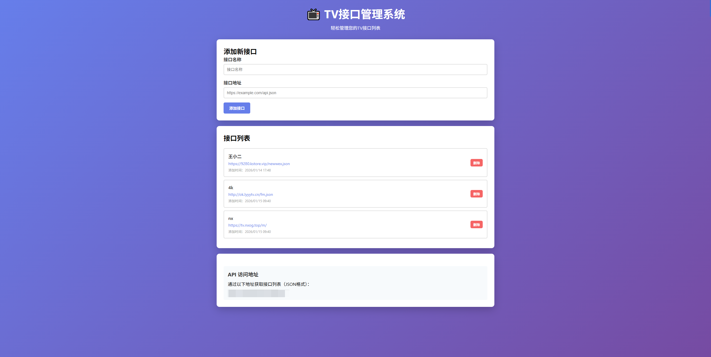

# TV接口管理系统

一个可以部署在 Cloudflare Worker 上的TV接口管理系统，支持添加、删除和查询接口列表。

## 功能特性

- ✅ 添加TV接口（URL + 名称）
- ✅ 删除接口
- ✅ 查看接口列表（显示添加时间）
- ✅ API接口获取JSON格式列表
- ✅ 通过访问码保护（无需登录系统）
- ✅ 使用 Cloudflare KV 存储数据
- ✅ 响应式管理界面

## 部署步骤

### 1. 创建 KV 命名空间

在Workers KV中创建名为TV_KV的空间

### 2. 创建worker

将index.js代码复制后部署

### 3. 绑定KV，设置访问码

- 在概述中绑定KV命名空间，变量名称同样填TV_KV，KV命名空间选择刚才创建的
- 在设置中添加变量，名称为ACCESS_CODE，值为访问码

## 使用方法

### 管理页面

访问：`https://your-worker.workers.dev/{访问码}`

在管理页面可以：
- 添加新接口（输入名称和URL）
- 查看所有接口列表
- 删除不需要的接口
- 查看每个接口的添加时间

### API 接口

获取接口列表（JSON格式）：
```
GET https://your-worker.workers.dev/api/{访问码}
```

返回格式：
```json
{
  "urls": [
    {
      "url": "https://tv.example.com/api.json",
      "name": "示例接口",
      "addedAt": "2024-01-14T12:00:00.000Z"
    }
  ]
}
```

## API 文档

### 获取接口列表
- **方法**: GET
- **路径**: `/api/{访问码}`
- **响应**: JSON格式的接口列表

### 添加接口
- **方法**: POST
- **路径**: `/api/{访问码}`
- **请求体**:
```json
{
  "url": "https://example.com/api.json",
  "name": "接口名称"
}
```

### 删除接口
- **方法**: DELETE
- **路径**: `/api/{访问码}`
- **请求体**:
```json
{
  "url": "https://example.com/api.json"
}
```

## 安全说明

1. **访问码保护**：所有操作都需要正确的访问码
3. **CORS支持**：API接口支持跨域访问
4. **数据持久化**：使用 Cloudflare KV 存储，数据永久保存

## 注意事项

- Cloudflare Workers 免费版每天有 100,000 次请求限制
- KV 免费版每天有 100,000 次读取和 1,000 次写入限制
- 访问码请设置复杂一些，避免被猜测

## 界面
